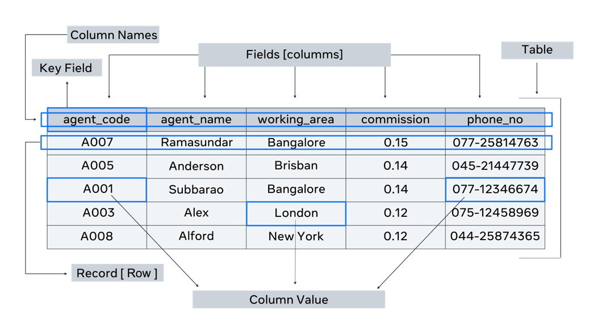

# Course 4 - Databases

#### Database
- A form of electronic storage that holds data
- [Course Goals](https://www.coursera.org/learn/intro-to-databases-back-end-development/supplement/TptnH/course-syllabus-introduction-to-databases)
-  each instance must be uniquely identifiable
-  **Primary Key Field** - unique values that cannot be replicated elsewhere in the table/entity
   - This avoids potential confusion between tables with similarities in data
 - **Foreign Key** - a field in one table that connects to the primary key field in the original table
 - **Big data** - complex data that grows exponentially with time

#### Stages of Databases (History)
**Flat Files**
- Used during 1970s-1990s
- A type of a database system that stores data in a single file or table - basically text files, where every line contains one record and fields either have fixed lengths or are separated by commas, whitespaces, and tabs - cannot contain multiple tables
(Think of an excel file in CSV format)

**Hierarchical database systems**
- store data in a hierarchically arranged manner
- One to many relationship - parent can have multiple children, but one child can only have one parent

**Network databases**
- unlike the hierarchical database model, allows multiple parent child relationships - many to many relationships (memberse & owners)
- has a graph-like structure

**Relational Database system**
- Data is stored in tables
- Columns of the table hold attributes of the data
- Each record usually has a value for each attribute
- In a relational database, each row in the table is a record with a unique ID attribute called the primary key
- A relational database stores and provides access to data that are related to one anotehr using an ttribute known as a foreign key
  - Foreign keys can be duplicate/null as they serve to show the relation between databases/tables

**Object Oriented Databases**
- these are databases that store data in the form of objects as opposed to the traditional relational databases that store data in tables
- Data is encapsulated within objects, which can contain attribtues (data fields) and methods (functions or precedures taht operate on the data).
- These objects are instances of classes, which define the structure and behavior of the objects


**NoSQL databases**
- Preferred over relational databases because relational databases only allows to store structured data.
- NoSQL databases are faster and more flexible in storing data - can deal with unstructured data
- Data can be stored in an ad-hoc manner and they allow to store and process high volumes of different kinds of data

### Structured Query Langauge (SQL)

**CRUD operations** - Create, Read, Update, Delete

**SQL** - Standard language that can interact with structured data on databases
- Used to communicate with and manipulate databases
- Used for querying, updating, and managing data in relational database management systems 
- Some key functions include SELECT, INSERT, UPDATE, DELETE, CREATE, ALTER, DROP, GRAND, REVOKE, etc.
**MySQL** - A specific relational database management system that uses SQL as its query language

- SQL is like English (a language), while MySQL is like a specific book written in English. Many books can be written in English, just like there are many RDBMS (relational database management system) systems that use SQL

#### SQL Subsets

SQL consists of several subsets, each designed for different types of database operations. These subsets help categorize the various functionalities of SQL, making it easier to understand and use. The main subsets of SQL are:
1. **Data Definition Language (DDL)** - defines and manages database structures
   1. CREATE, ALTER, DROP, TRUNCATE, RENAME
2. **Data Manipulation Language** - Manages data within the database
   1. SELECT, INSERT, UPDATE, DELETE
3. **Data Query Language** - Primarily focused on querying and retrieving data from databases
   1. SELECT!!
4. **Data Control Language** - Controls access to the data
   1. GRANT, REVOKE
5. **Transaction Control Language** - Manages transactions to ensure data integrity
      1. COMMIT, ROLLBACK, SAVEPOINT, RELEASE SAVEPOINT, SET TRANSACTION

##### SQL Advantages
- **User-friendly** - requires very little coding skills
- **Standard Langauge** - compatible with all available relational databases
  - can run on any computer 
- **Portable Language** - can be used on any hardware running on any operating system

**SQL Syntax**
```SQL
-- 1. Create a Database and tables using the DDL subset of SQL (Data Definition Language)

--create a database
CREATE DATABASE college;
--once data base created, create a table
CREATE TABLE table_name;

--delete a database or table inside the database using DROP
DROP TABLE table_name;

-- Change the structure of the tables in the database using ALTER
--adding column to table
ALTER TABLE table_name ADD (column_name datatype(size));
--Adding primary key to a table
ALTER TABLE table_name ADD primary key (column_name);

--remove all records from table but keep table
TRUNCATE TABLE table_name;

-- 2. Utilize the DML subset of SQL to populate and modify data in a database (Data Manipulation Language)

-- Add data to a table
INSERT INTO table_name (column1, column2, column3 ...) VALUES (val1, val2, val3);

--Update data in a table
UPDATE Student ;
SET date_of_birth = '2000-10-12' WHERE ID = 02;

--Delete data from a table
DELETE FROM Student WHERE ID = 03;

-- 3. Read and query data within databases using the DQL subset of SQL (Data Query Language)

--Select/Query data within a table
SELECT first_name, last_name FROM Student WHERE ID = '01';
```

- The **Data Type** of a column defines what type of value a table column can hold
  - tells SQL what data type to expect in each column
  - Strings, Numeric, Date and Time, Binary are common data types that are supported on all database systems 
- A column in the table that has unique values will become the **primary key** of the table (ex. ID)
  - **Composite primary key** is when the primary key is comprised of more than one column/field (when you need to use two different columns/fields to uniquely identify any tuple/row/item)
  - Any attribute that contains a unique value in each row of the table are all considered **Candidate Key Attributes**
  - A candidate key not selected as the primary key is called an **Alternate key**

##### Integrity Constraints
1. Key constraints
2. Domain constraints
3. Referential integrity constraints - when a table is related to another table via a foreign key column, then the referenced column value must exist in the other table

##### Database Structure
Database structure refers to how data is arranged in a database. Within a database, related data are grouped into tables, each of which consists rows (tuples) and columns, like in a spreadsheet


**Logical database structure**
- The logical structure of a database is represented using a diagram known as the Entity Relationship Diagram (ERD)
- Visual representation of how the database will be implemented into tables during physical database design, using a DBMS like MySQL or Oracle

